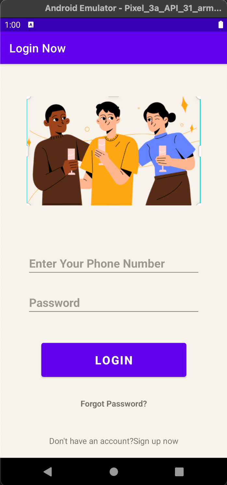
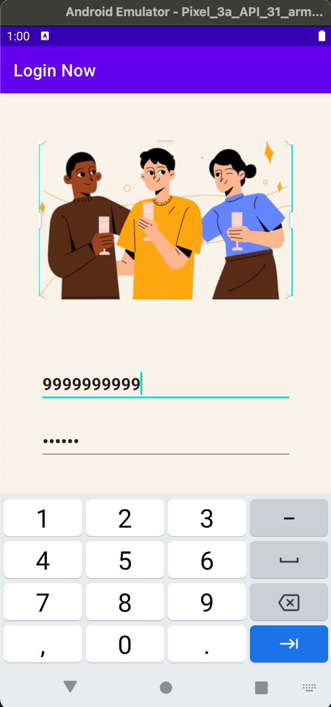
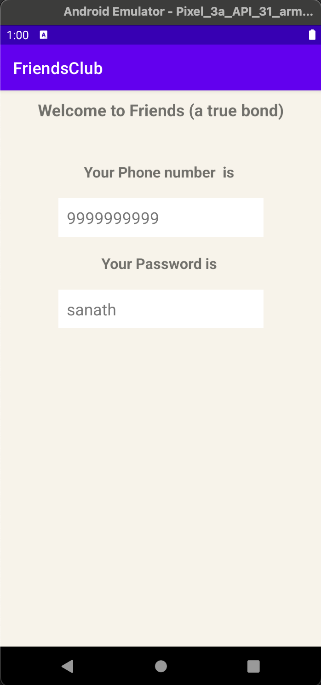
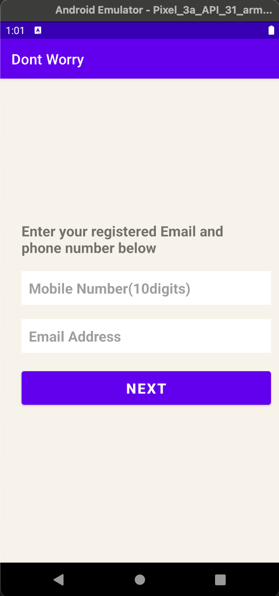
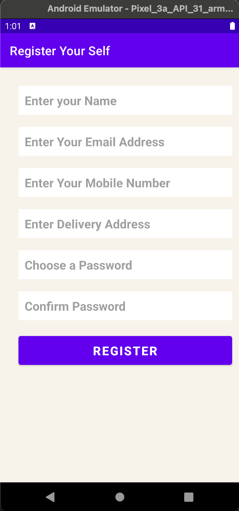

# FriendsAppKotlin
### This app is made with the help of online courses.
## This app is completely of own theme and hadn't copied from anyone else except the images.

## Screen Shots

## Program
### Layout codes
~~~
<?xml version="1.0" encoding="utf-8"?>
<RelativeLayout xmlns:android="http://schemas.android.com/apk/res/android"
    xmlns:app="http://schemas.android.com/apk/res-auto"
    xmlns:tools="http://schemas.android.com/tools"
    android:layout_width="match_parent"
    android:layout_height="match_parent"
    tools:context=".MainActivity"
    android:background="@drawable/background">

    <TextView
        android:id="@+id/txtwelcome"
        android:layout_width="wrap_content"
        android:layout_height="wrap_content"
        android:text="Welcome to Friends (a true bond)"
        android:layout_centerHorizontal="true"
        android:padding="10dp"
        android:textStyle="bold"
        android:textSize="20sp"
        />
    <TextView
        android:id="@+id/txtVPhonenumber"
        android:layout_width="wrap_content"
        android:layout_height="wrap_content"
        android:text="Your Phone number  is "
        android:layout_centerHorizontal="true"
        android:textStyle="bold"
        android:layout_marginTop="40dp"
        android:textSize="18sp"
        android:layout_below="@+id/txtwelcome"/>
    <TextView
        android:id="@+id/txtPhoneNumber"
        android:layout_width="250dp"
        android:layout_height="wrap_content"
        android:background="@color/white"
        android:layout_below="@+id/txtVPhonenumber"
        android:padding="10dp"
        android:layout_centerHorizontal="true"
        android:layout_marginTop="20dp"
        android:textSize="20sp"/>
    <TextView
        android:id="@+id/txtVPassword"
        android:layout_width="wrap_content"
        android:layout_height="wrap_content"
        android:text="Your Password is "
        android:layout_centerHorizontal="true"
        android:textStyle="bold"
        android:layout_marginTop="20dp"
        android:textSize="18sp"
        android:layout_below="@+id/txtPhoneNumber"/>
    <TextView
        android:id="@+id/txtPassword"
        android:layout_width="250dp"
        android:layout_height="wrap_content"
        android:background="@color/white"
        android:layout_below="@+id/txtVPassword"
        android:padding="10dp"
        android:layout_centerHorizontal="true"
        android:layout_marginTop="20dp"
        android:textSize="20sp"/>
</RelativeLayout>

<?xml version="1.0" encoding="utf-8"?>
<LinearLayout xmlns:android="http://schemas.android.com/apk/res/android"
             android:layout_width="match_parent"
             android:layout_height="match_parent"
             android:orientation="vertical"
    android:background="@drawable/background">
    <TextView
        android:layout_width="wrap_content"
        android:layout_height="wrap_content"
        android:text="Enter your registered Email and phone number below"
        android:textStyle="bold"
        android:textSize="20sp"
        android:layout_marginTop="200dp"
        android:layout_marginLeft="30dp"
        android:layout_marginRight="30dp"/>
    <EditText
        android:id="@+id/etMobileNumber"
        android:layout_width="350dp"
        android:layout_height="wrap_content"
        android:background="@color/white"
        android:padding="10dp"
        android:textSize="20sp"
        android:textStyle="bold"
        android:layout_marginLeft="30dp"
        android:layout_marginTop="20dp"
        android:hint="Mobile Number(10digits)"
        android:inputType="number"
        />
    <EditText
        android:id="@+id/etEmailAddress"
        android:layout_width="350dp"
        android:layout_height="wrap_content"
        android:background="@color/white"
        android:padding="10dp"
        android:textSize="20sp"
        android:textStyle="bold"
        android:layout_marginLeft="30dp"
        android:layout_marginTop="20dp"
        android:hint="Email Address"
        android:inputType="textEmailAddress"/>
    <Button
        android:id="@+id/btnNext"
        android:layout_width="350dp"
        android:layout_height="wrap_content"
        android:padding="10dp"
        android:textSize="20sp"
        android:textStyle="bold"
        android:layout_marginLeft="30dp"
        android:layout_marginTop="20dp"
        android:text="NEXT"
        />

</LinearLayout>

<?xml version="1.0" encoding="utf-8"?>
<RelativeLayout xmlns:android="http://schemas.android.com/apk/res/android"
    android:layout_width="match_parent"
    android:layout_height="match_parent"
    android:background="@drawable/background">
    <TextView
        android:id="@+id/txtfv"
        android:layout_width="wrap_content"
        android:layout_height="wrap_content"
        android:text="Lets recover your password!"
        android:textSize="20sp"
        android:textStyle="bold"
        android:layout_centerHorizontal="true"
        android:layout_marginTop="30dp"/>
    <TextView
        android:id="@+id/txthead"
        android:layout_width="wrap_content"
        android:layout_height="wrap_content"
        android:text="Your Mobiel Number"
        android:layout_below="@+id/txtfv"
        android:textSize="20sp"
        android:textStyle="bold"
        android:layout_centerHorizontal="true"
        android:layout_marginTop="30dp"/>

    <TextView
        android:id="@+id/txtMv"
        android:layout_width="250dp"
        android:layout_height="wrap_content"
        android:layout_below="@+id/txthead"
        android:layout_centerHorizontal="true"
        android:layout_marginTop="20dp"
        android:background="@color/white"
        android:padding="10dp"
        android:textSize="18sp"
        android:textStyle="bold" />
    <TextView
        android:id="@+id/txthead2"
        android:layout_width="wrap_content"
        android:layout_height="wrap_content"
        android:text="Your Email Address "
        android:layout_below="@+id/txtMv"
        android:textSize="20sp"
        android:textStyle="bold"
        android:layout_centerHorizontal="true"
        android:layout_marginTop="30dp"/>

    <TextView
        android:id="@+id/txtEv"
        android:layout_width="250dp"
        android:layout_height="wrap_content"
        android:layout_below="@+id/txthead2"
        android:layout_centerHorizontal="true"
        android:layout_marginTop="20dp"
        android:background="@color/white"
        android:padding="10dp"
        android:textSize="18sp"
        android:textStyle="bold" />

</RelativeLayout>

<?xml version="1.0" encoding="utf-8"?>
<RelativeLayout xmlns:android="http://schemas.android.com/apk/res/android"
    android:layout_width="match_parent"
    android:layout_height="match_parent"
    android:background="@drawable/background">
    <ImageView
        android:id="@+id/imgLogo"
        android:layout_width="300dp"
        android:layout_height="300dp"
        android:src="@drawable/logo"
        android:layout_centerHorizontal="true"/>

    <EditText
        android:id="@+id/etPhoneNumber"
        android:layout_width="300dp"
        android:layout_height="wrap_content"
        android:layout_below="@+id/imgLogo"
        android:layout_centerHorizontal="true"
        android:layout_marginTop="20dp"
        android:hint="Enter Your Phone Number"
        android:inputType="number"
        android:textSize="20sp"
        android:textStyle="bold" />

    <EditText
        android:id="@+id/etPassword"
        android:layout_width="300dp"
        android:layout_height="wrap_content"
        android:layout_below="@+id/etPhoneNumber"
        android:layout_centerHorizontal="true"
        android:layout_marginTop="20dp"
        android:hint="Password"
        android:inputType="textPassword"
        android:textSize="20sp"
        android:textStyle="bold" />
    <Button
        android:id="@+id/btnLogin"
        android:layout_width="250dp"
        android:layout_height="70dp"
        android:text="Login"
        android:textStyle="bold"
        android:layout_below="@+id/etPassword"
        android:layout_centerHorizontal="true"
        android:layout_marginBottom="30dp"
        android:layout_marginTop="40dp"
        android:textSize="20sp"
        android:padding="5dp"/>
    <TextView
        android:id="@+id/etForgot"
        android:layout_width="wrap_content"
        android:layout_height="wrap_content"
        android:text="Forgot Password?"
        android:layout_centerHorizontal="true"
        android:layout_below="@+id/btnLogin"
        android:textStyle="bold"/>
    <TextView
        android:id="@+id/register"
        android:layout_width="wrap_content"
        android:layout_height="wrap_content"
        android:text="Don't have an account?Sign up now"
        android:layout_alignParentBottom="true"
        android:layout_centerHorizontal="true"
        android:layout_marginBottom="20dp"/>

</RelativeLayout>

<?xml version="1.0" encoding="utf-8"?>
<RelativeLayout xmlns:android="http://schemas.android.com/apk/res/android"
    android:layout_width="match_parent"
    android:layout_height="match_parent"
    android:background="@drawable/background">

    <EditText
        android:id="@+id/etName"
        android:layout_width="350dp"
        android:layout_height="wrap_content"
        android:layout_marginLeft="30dp"
        android:layout_marginTop="30dp"
        android:background="@color/white"
        android:hint="Enter your Name"
        android:padding="10dp"
        android:textSize="20sp"

        android:textStyle="bold" />

    <EditText
        android:id="@+id/etEmail"
        android:layout_width="350dp"
        android:layout_height="wrap_content"
        android:layout_below="@+id/etName"
        android:layout_marginLeft="30dp"
        android:layout_marginTop="20dp"
        android:background="@color/white"
        android:hint="Enter Your Email Address"
        android:padding="10dp"
        android:textSize="20sp"

        android:textStyle="bold" />

    <EditText
        android:id="@+id/etMobileNumber"
        android:layout_width="350dp"
        android:layout_height="wrap_content"
        android:layout_below="@+id/etEmail"
        android:layout_marginLeft="30dp"
        android:layout_marginTop="20dp"
        android:background="@color/white"
        android:hint="Enter Your Mobile Number"
        android:inputType="number"
        android:padding="10dp"
        android:textSize="20sp"

        android:textStyle="bold" />
    <EditText
        android:id="@+id/etDeliveryAddress"
        android:layout_width="350dp"
        android:layout_height="wrap_content"
        android:layout_below="@+id/etMobileNumber"
        android:layout_marginLeft="30dp"
        android:layout_marginTop="20dp"
        android:hint="Enter Delivery Address"
        android:background="@color/white"
        android:padding="10dp"

        android:textStyle="bold"
        android:textSize="20sp"/>

    <EditText
        android:id="@+id/etPassword"
        android:layout_width="350dp"
        android:layout_height="wrap_content"
        android:layout_below="@+id/etDeliveryAddress"
        android:layout_marginLeft="30dp"
        android:layout_marginTop="20dp"
        android:background="@color/white"
        android:hint="Choose a Password"
        android:inputType="textPassword"
        android:padding="10dp"
        android:textSize="20sp"
        android:textStyle="bold" />

    <EditText
        android:id="@+id/etConfirm"
        android:layout_width="350dp"
        android:layout_height="wrap_content"
        android:layout_below="@+id/etPassword"
        android:layout_marginLeft="30dp"
        android:layout_marginTop="20dp"
        android:background="@color/white"
        android:hint="Confirm Password"
        android:inputType="textPassword"
        android:padding="10dp"
        android:textSize="20sp"
        android:textStyle="bold" />
    <Button
        android:id="@+id/btnRegister"
        android:layout_width="350dp"
        android:layout_height="wrap_content"
        android:text="Register"
        android:layout_below="@+id/etConfirm"
        android:layout_marginTop="20dp"
        android:layout_marginLeft="30dp"
        android:padding="10dp"
        android:textSize="20sp"
        android:textStyle="bold"/>

</RelativeLayout>

<?xml version="1.0" encoding="utf-8"?>
<RelativeLayout xmlns:android="http://schemas.android.com/apk/res/android"
    android:layout_width="match_parent"
    android:layout_height="match_parent"
    android:background="@drawable/background">
    <TextView
        android:id="@+id/txtYourName"
        android:layout_width="wrap_content"
        android:layout_height="wrap_content"
        android:text="Your Name "
        android:textStyle="bold"
        android:textSize="20sp"
        android:layout_centerHorizontal="true"
        android:layout_marginTop="40dp"/>
    <TextView
        android:id="@+id/txtName"
        android:layout_width="250dp"
        android:layout_height="wrap_content"
        android:background="@color/white"
        android:padding="5dp"
        android:layout_below="@+id/txtYourName"
        android:textStyle="bold"
        android:textSize="20sp"
        android:layout_centerHorizontal="true"
        android:layout_marginTop="10dp"/>
    <TextView
        android:id="@+id/txtYourEmail"
        android:layout_width="wrap_content"
        android:layout_height="wrap_content"
        android:layout_below="@+id/txtName"
        android:text="Your Email "
        android:textStyle="bold"
        android:textSize="20sp"
        android:layout_centerHorizontal="true"
        android:layout_marginTop="40dp"/>
    <TextView
        android:id="@+id/txtEmail"
        android:layout_width="250dp"
        android:layout_height="wrap_content"
        android:background="@color/white"
        android:padding="5dp"
        android:layout_below="@+id/txtYourEmail"
        android:textStyle="bold"
        android:textSize="20sp"
        android:layout_centerHorizontal="true"
        android:layout_marginTop="10dp"/>

    <TextView
        android:id="@+id/txtYourMobile"
        android:layout_width="wrap_content"
        android:layout_height="wrap_content"
        android:layout_below="@+id/txtEmail"
        android:layout_centerHorizontal="true"
        android:layout_marginTop="40dp"
        android:text="Your Mobile Number"
        android:textSize="20sp"
        android:textStyle="bold" />

    <TextView
        android:id="@+id/txtMobile"
        android:layout_width="250dp"
        android:layout_height="wrap_content"
        android:layout_below="@+id/txtYourMobile"
        android:layout_centerHorizontal="true"
        android:layout_marginTop="10dp"
        android:background="@color/white"
        android:padding="5dp"
        android:textSize="20sp"
        android:textStyle="bold" />

    <TextView
        android:id="@+id/txtYourAddress"
        android:layout_width="wrap_content"
        android:layout_height="wrap_content"
        android:layout_below="@+id/txtMobile"
        android:layout_centerHorizontal="true"
        android:layout_marginTop="40dp"
        android:text="Your Address "
        android:textSize="20sp"
        android:textStyle="bold" />
    <TextView
        android:id="@+id/txtAddress"
        android:layout_width="250dp"
        android:layout_height="wrap_content"
        android:background="@color/white"
        android:padding="5dp"
        android:layout_below="@+id/txtYourAddress"
        android:textStyle="bold"
        android:textSize="20sp"
        android:layout_centerHorizontal="true"
        android:layout_marginTop="10dp"/>
    <TextView
        android:id="@+id/txtYourPassword"
        android:layout_width="wrap_content"
        android:layout_height="wrap_content"
        android:layout_below="@+id/txtAddress"
        android:text="Your Password"
        android:textStyle="bold"
        android:textSize="20sp"
        android:layout_centerHorizontal="true"
        android:layout_marginTop="40dp"/>

    <TextView
        android:id="@+id/txtPassword"
        android:layout_width="250dp"
        android:layout_height="wrap_content"
        android:background="@color/white"
        android:padding="5dp"
        android:layout_below="@+id/txtYourPassword"
        android:textStyle="bold"
        android:textSize="20sp"
        android:layout_centerHorizontal="true"
        android:layout_marginTop="10dp"/>

</RelativeLayout>

<?xml version="1.0" encoding="utf-8"?>
<LinearLayout xmlns:android="http://schemas.android.com/apk/res/android"
    android:layout_width="match_parent"
    android:layout_height="match_parent"
    android:orientation="vertical"
    >

    <ImageView
        android:layout_width="fill_parent"
        android:layout_height="fill_parent"
        android:scaleType="centerCrop"
        android:adjustViewBounds="true"
        android:src="@drawable/splash_screen" />

</LinearLayout>

~~~
### Activity Codes
~~~
package com.sanath.assignment

import android.content.Intent
import android.os.Bundle
import androidx.appcompat.app.AppCompatActivity

class splashActivity: AppCompatActivity() {
    override fun onCreate(savedInstanceState: Bundle?) {
        super.onCreate(savedInstanceState)
        setContentView(R.layout.splash_activity)
        val intent = Intent(this@splashActivity,loginActivity::class.java)
        startActivity(intent)
        finish()
    }
}

package com.sanath.assignment

import android.content.Intent
import android.os.Bundle
import android.widget.Button
import android.widget.EditText
import android.widget.TextView
import android.widget.Toast
import androidx.appcompat.app.AppCompatActivity

class loginActivity: AppCompatActivity() {
    lateinit var etregister:TextView
    lateinit var etForgot:TextView
    lateinit var btnLogin: Button
    lateinit var etPhoneNumber: EditText
    lateinit var etPassword:EditText
    val validMobileNumbers = arrayOf("9999999999","0011223344")
    val validPassword = arrayOf("sanath","sunny")

    override fun onCreate(savedInstanceState: Bundle?) {
        super.onCreate(savedInstanceState)
        setContentView(R.layout.login_activity)
        title = "Login Now"
        etregister = findViewById(R.id.register)
        etForgot = findViewById(R.id.etForgot)
        btnLogin = findViewById((R.id.btnLogin))
        etPhoneNumber =findViewById(R.id.etPhoneNumber)
        etPassword = findViewById(R.id.etPassword)

        val intetB = Intent(this@loginActivity,registerActivity::class.java)
        etregister.setOnClickListener {
            startActivity(intetB)
        }
        val intentC = Intent(this@loginActivity,forgotActivity::class.java)
        etForgot.setOnClickListener {
            startActivity(intentC)
        }
        btnLogin.setOnClickListener {
            val mobileNumber = etPhoneNumber.text.toString()
            val password = etPassword.text.toString()
            val intentD = Intent(this@loginActivity,MainActivity::class.java)
            intentD.putExtra("mobileNumber",mobileNumber)
            intentD.putExtra("password",password)
            if(validMobileNumbers[0]==mobileNumber && validPassword[0] == password){
                startActivity(intentD)
                Toast.makeText(this@loginActivity,"Logged in as Sanath",Toast.LENGTH_LONG).show()
            }else if(validMobileNumbers[1]==mobileNumber && validPassword[1] == password){
                startActivity(intentD)
                intentD.putExtra("mobileNumber",mobileNumber)
                intentD.putExtra("password",password)
                Toast.makeText(this@loginActivity,"Logged in as Sunny",Toast.LENGTH_LONG).show()
            }else{
                Toast.makeText(this@loginActivity,"Invalid Credentials",Toast.LENGTH_LONG).show()
            }

        }

    }
}

package com.sanath.assignment

import android.content.Intent
import android.os.Bundle
import android.widget.Button
import android.widget.EditText
import android.widget.TextView
import androidx.appcompat.app.AppCompatActivity

class registerActivity:AppCompatActivity() {
    lateinit var etName: EditText
    lateinit var etEmail: EditText
    lateinit var etMobileNumber: EditText
    lateinit var etDeliveryAddress:EditText
    lateinit var etPassword:EditText
    lateinit var btnRegister:Button

    override fun onCreate(savedInstanceState: Bundle?) {
        super.onCreate(savedInstanceState)
        setContentView(R.layout.register_activity)
        title ="Register Your Self"
        etName = findViewById(R.id.etName)
        etEmail = findViewById(R.id.etEmail)
        etMobileNumber = findViewById(R.id.etMobileNumber)
        etDeliveryAddress = findViewById(R.id.etDeliveryAddress)
        etPassword = findViewById(R.id.etPassword)
        btnRegister = findViewById(R.id.btnRegister)

        val intent = Intent(this@registerActivity,RegisterView::class.java)
        btnRegister.setOnClickListener {
            val name = etName.text.toString()
            val email = etEmail.text.toString()
            val number  = etMobileNumber.text.toString()
            val address = etDeliveryAddress.text.toString()
            val password = etPassword.text.toString()
            intent.putExtra("Name",name)
            intent.putExtra("Email",email)
            intent.putExtra("number",number)
            intent.putExtra("Address",address)
            intent.putExtra("Password",password)
            startActivity(intent)
        }

    }
}

package com.sanath.assignment

import android.content.Intent
import android.os.Bundle
import android.widget.Button
import android.widget.EditText
import androidx.appcompat.app.AppCompatActivity

class forgotActivity:AppCompatActivity() {
    lateinit var etMobileNumber:EditText
    lateinit var etEmailAddress: EditText
    lateinit var btnNext : Button
    override fun onCreate(savedInstanceState: Bundle?) {
        super.onCreate(savedInstanceState)
        setContentView(R.layout.forgot_activity)
        title = "Dont Worry"
        etMobileNumber = findViewById(R.id.etMobileNumber)
        etEmailAddress = findViewById(R.id.etEmailAddress)
        btnNext = findViewById(R.id.btnNext)

        val intent = Intent(this@forgotActivity,ForgotView::class.java)

                btnNext.setOnClickListener {
            val mobileNumber = etMobileNumber.text.toString()
            val emailAddress = etEmailAddress.text.toString()
                    intent.putExtra("MobileNumber",mobileNumber)
                    intent.putExtra("EmailAddress",emailAddress)

            startActivity(intent)
        }

    }
}

package com.sanath.assignment

import android.content.Intent
import androidx.appcompat.app.AppCompatActivity
import android.os.Bundle
import android.widget.TextView
import org.w3c.dom.Text

class RegisterView : AppCompatActivity() {
    override fun onCreate(savedInstanceState: Bundle?) {
        super.onCreate(savedInstanceState)
        setContentView(R.layout.register_view)
        var intent = getIntent()
        val name = intent.getStringExtra("Name")
        val email = intent.getStringExtra("Email")
        val mobile = intent.getStringExtra("number")
        val address = intent.getStringExtra("Address")
        val password = intent.getStringExtra("Password")
        var nameView = findViewById<TextView>(R.id.txtName).apply{
            text = name
        }
        var emailView = findViewById<TextView>(R.id.txtEmail).apply{
            text = email
        }
        var mobileView = findViewById<TextView>(R.id.txtMobile).apply {
            text = mobile
        }
        var adderssView = findViewById<TextView>(R.id.txtAddress).apply{
            text = address
        }
        var passwordView = findViewById<TextView>(R.id.txtPassword).apply {
            text = password
        }
    }
}

package com.sanath.assignment

import androidx.appcompat.app.AppCompatActivity
import android.os.Bundle
import android.widget.EditText
import android.widget.TextView

class ForgotView : AppCompatActivity() {
    override fun onCreate(savedInstanceState: Bundle?) {
        super.onCreate(savedInstanceState)
        setContentView(R.layout.forgot_view)
        var intent = getIntent()
        val message = intent.getStringExtra("MobileNumber")
        val message2 = intent.getStringExtra("EmailAddress")
        var mobile = findViewById<TextView>(R.id.txtMv).apply {
            text= message
        }
        var email = findViewById<TextView>(R.id.txtEv).apply{
            text = message2
        }
    }
}
~~~

